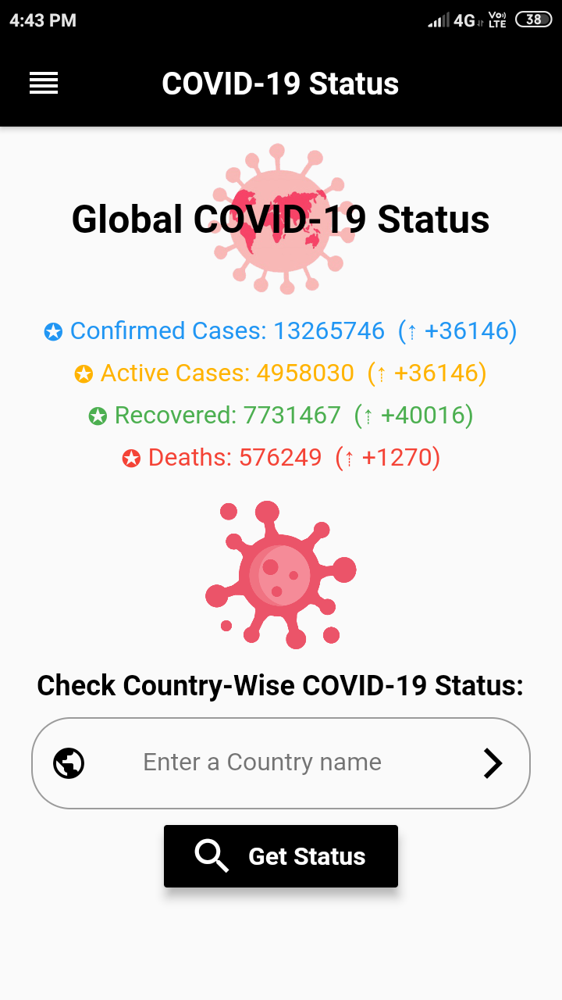
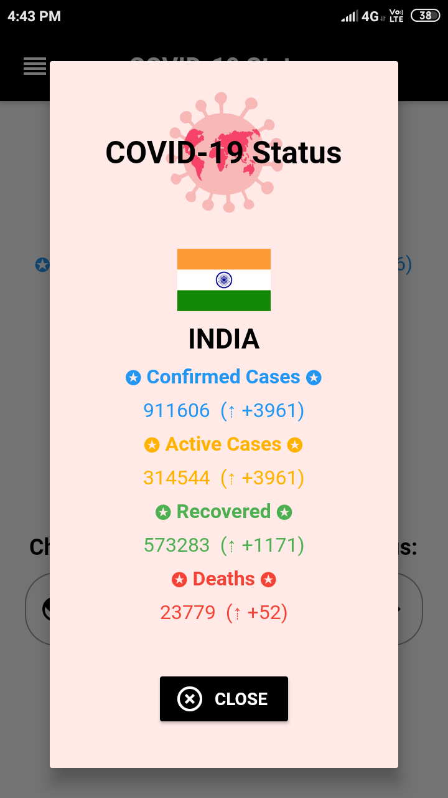

# COVID-19-Status
The global COVID-19 tracker for android using flutter.    
This application shows Covid-19 statistics in different countries of the world.  
# Data SOURCE for COVID-19 Global Statistics : <a href="https://disease.sh/">https://disease.sh/</a>

<b>*Screenshots of app:*</b>    

      

<b>Copyright © 2020 Saurav Kumar</b>
